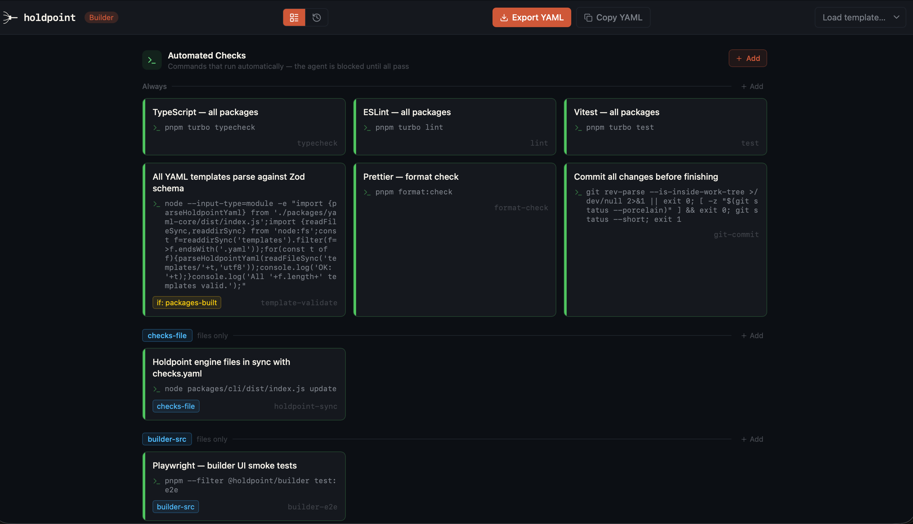

# Holdpoint

> **AI coding agents skip your tests, miss your lints, and claim done on broken code. Holdpoint won't let them commit until the checks you wrote actually pass.**

[](https://github.com/holdpoint-dev/holdpoint/actions/workflows/ci.yml)



One `checks.yaml` at the root of your repo defines what must pass — lint, tests, types, anything you can express as a shell command or a manual confirmation. Holdpoint wires that file into hooks for GitHub Copilot CLI, Claude Code, OpenAI Codex, and Cursor, so the same gates apply no matter which agent is driving. It also ships **Holdpoint Live**, a local daemon and browser UI for watching sessions, check runs, and cross-agent file conflicts as they happen.

> ⚠️ **Alpha software** — `@holdpoint/*` packages are published to npm under the `alpha` tag only. APIs and config schema may change before 1.0. Feedback welcome via [GitHub Issues](https://github.com/holdpoint-dev/holdpoint/issues).

### macOS / Linux

```bash
curl -fsSL https://holdpoint.dev/install.sh | sh
```

### Windows (PowerShell)

```powershell
powershell -NoProfile -ExecutionPolicy Bypass -Command "irm https://holdpoint.dev/install.ps1 | iex"
```

Or with `npx` (cross-platform):

```bash
npx holdpoint@alpha init
```

> `holdpoint init` runs an agent preflight at the end of install and prints the exact follow-up commands per agent (Copilot `/experimental on`, Codex `codex trust`, Cursor advisory notice). Full notes also land in `HOLDPOINT_PREREQUISITES.md`.

## How it works

1. **`checks.yaml`** at your project root defines deterministic (shell) and manual (agent-confirmed) checks.
2. **Trigger matching** — checks only activate for relevant file types (frontend, backend, structural, etc.) — see [file filters](https://holdpoint.dev/docs#when-scopes)
3. **Engines** — Copilot CLI gets `extension.mjs`, Claude Code gets `.claude/settings.json` hooks, Cursor gets `.cursorrules` additions, OpenAI Codex gets `.codex/hooks.json` + `AGENTS.md`.
4. **Unified browser UI** — `npx holdpoint live` opens the daemon-served Live view at `/live/`, while `npx holdpoint builder` opens the same daemon at `/builder/` to edit `checks.yaml` without writing YAML. Checks are organised into **Automated** (cmd), **Manual** (prompt), and **Conditions** sections, each grouped by `when` scope. The **History** tab shows the last 50 check run reports — including per-check pass/fail/skip results, changed files, and HEAD SHA.

## Status

Holdpoint is in **early alpha**. What works today:

- Deterministic check enforcement on GitHub Copilot CLI
- Deterministic check enforcement on Claude Code (`TaskCompleted` + `Stop` exit-2 gates, session-context injection, and broad Live lifecycle hooks)
- Deterministic check enforcement on OpenAI Codex (Stop hook via `.codex/hooks.json`)
- Holdpoint Live Phase 1-5 core — local daemon, browser UI, project/session timeline, passive conflict detection, Copilot-only live control, and external engine discovery
- YAML schema + validation (`yaml-core` package, covered by tests)
- Unified default template with checks gated by file scope and project marker files
- Visual builder ships inside the daemon-served UI — works for any installed user (`holdpoint builder`)
- Test coverage across engine packages, CLI detection, and the new Live foundation packages

What's incomplete:

- Cursor support is advisory; no hard block (see Supported agents above)
- Codex hooks require `codex trust` in TUI to activate project-level hooks
- Packages published to npm — `npx holdpoint@alpha init` or `npx @holdpoint/cli@alpha init`
- npm-published API surface may change before 1.0

## Live (alpha)

Holdpoint Live is the local observability layer for agent sessions. The current alpha ships:

- `holdpoint live` ensures the singleton daemon and opens the browser UI; bare `holdpoint` prints help
- `holdpoint daemon start|status|stop` manages the same singleton daemon explicitly
- `holdpoint event` ingests protocol events or converts native hook payloads through discovered engines
- `holdpoint engines [--json]` lists built-in and installed third-party engine packages plus ignore reasons
- The daemon serves one browser surface with `/live/` for sessions and `/builder/` for checks.yaml editing
- Conflict detection warns when two sessions in the same project target the same file path so overlapping edits are visible immediately
- Claude hooks emit best-effort lifecycle events without turning observability into a new hard gate
- Copilot sessions register a persistent live bridge with pending approval controls, queued context injection, completion gate pass/block events, bounded context/check output, and a reference `holdpoint_dry_run` control tool
- `holdpoint check` emits `check_run` events into the daemon for a per-project check timeline

For engine authors, the Live surface is also available as packages:

- `@holdpoint/live-protocol` — versioned event, HTTP, and WebSocket schema
- `@holdpoint/sdk` — `BridgeClient`, `LiveAdapter`, and helper types for building third-party engines
- `holdpoint event` — the bridge CLI entrypoint engines call from native hook payloads

What is **not** shipped yet: generic external check-generation plugins, hook auto-spawn, and cross-agent context injection. Those remain tracked in `HOLDPOINT_LIVE_SPEC.md`.

## Quick start

```bash
# In your project root (git repo required)
npx holdpoint@alpha init

# Run checks manually
npx holdpoint@alpha check

# Open Holdpoint Live for the current project
npx holdpoint@alpha live

# Or start the daemon explicitly
npx holdpoint@alpha daemon start

# Scan the project and propose new checks (dry run)
npx holdpoint@alpha suggest

# Apply proposals and regenerate engine files
npx holdpoint@alpha suggest --apply

# Open the visual builder
npx holdpoint@alpha builder

# Validate your checks.yaml
npx holdpoint@alpha validate
```

## Local repository development

If you are working inside the Holdpoint monorepo itself:

```bash
# Marketing site + visual builder
make dev

# Marketing site only
make dev-web

# Visual builder only
make dev-builder

# Start/reuse the real Holdpoint Live daemon and open the browser UI
make dev-live
```

`make dev` is intentionally scoped to the standalone contributor-facing UIs. `make dev-live`
opens the daemon-served Live app, which is the same surface end users see via `holdpoint live`.

## CLI commands

| Command                       | Description                                                          |
| ----------------------------- | -------------------------------------------------------------------- |
| `holdpoint`                   | Print help (no longer auto-opens the browser — use `holdpoint live`) |
| `holdpoint init [--agent]`    | Install for all agents by default; use `--agent` to restrict to one  |
| `holdpoint check [--staged]`  | Run deterministic checks                                             |
| `holdpoint live [--project]`  | Open Holdpoint Live, optionally focused to a specific project hash   |
| `holdpoint engines [--json]`  | List discovered Holdpoint Live engine packages and ignore reasons    |
| `holdpoint daemon start`      | Start or connect to the singleton Holdpoint Live daemon              |
| `holdpoint daemon status`     | Show daemon pid, port, uptime, and session count                     |
| `holdpoint daemon stop`       | Stop the running Holdpoint Live daemon                               |
| `holdpoint suggest [--apply]` | Scan project and propose (or apply) new checks                       |
| `holdpoint evolve [--apply]`  | Deprecated alias for `holdpoint suggest` — removed before 1.0        |
| `holdpoint require-changeset` | Require `.changeset/*.md` for release-affecting package changes      |
| `holdpoint event`             | Internal: ingest live event JSON from stdin                          |
| `holdpoint validate`          | Validate `checks.yaml` schema                                        |
| `holdpoint update`            | Regenerate engine files from current `checks.yaml`                   |
| `holdpoint builder`           | Open the daemon-served visual builder at `/builder/`                 |

## Default template

`holdpoint init` installs a single unified default template. Each check is gated by
`when:` path scopes and/or `conditionId:` project-marker files such as `package.json`,
`pyproject.toml`, `go.mod`, and `Cargo.toml`, so only relevant checks fire for a given
change.

## File filters (`when:`)

The `when:` field on a check limits it to specific file changes. Holdpoint ships 16 built-in named scopes:

| Scope        | Fires when                                                                                                             |
| ------------ | ---------------------------------------------------------------------------------------------------------------------- |
| `frontend`   | `**/*.tsx`, `**/*.jsx`, `**/*.css`, `apps/**`                                                                          |
| `backend`    | `**/api/**`, `**/server/**`, `packages/*/src/**`                                                                       |
| `structural` | `package.json`, `tsconfig*`, `Dockerfile*`, `*.tf`, config files — any file signalling toolchain or dependency changes |
| `testing`    | `**/*.test.*`, `**/*.spec.*`, `**/__tests__/**`                                                                        |
| `database`   | `**/*.sql`, `**/migrations/**`, `**/prisma/**`                                                                         |
| `infra`      | `**/Dockerfile*`, `**/docker-compose.*`, `**/*.tf`                                                                     |
| `ci`         | `**/.github/workflows/**`, `**/.circleci/**`                                                                           |
| `docs`       | `**/*.mdx`, `**/*.rst`, `**/docs/**`                                                                                   |
| …            | `python`, `go`, `rust`, `java`, `ruby`, `prisma`, `socket`, `visual`                                                   |

You can also define project-specific named patterns in `checks.yaml`:

```yaml
patterns:
  api-routes: "^src/api/"
  openapi-spec: "openapi\\.(yaml|yml|json)$"

checks:
  - id: openapi-lint
    label: "Lint OpenAPI spec"
    when: openapi-spec
    cmd: "npx redocly lint openapi.yaml"
```

Pattern values are JavaScript regexes. Built-in scope names cannot be overridden.

## Supported agents

| Agent              | Mechanism                                                                                                                |
| ------------------ | ------------------------------------------------------------------------------------------------------------------------ |
| GitHub Copilot CLI | `extension.mjs` — persistent SDK extension for `task_complete` gating, Live observability, and Copilot-only Live control |
| Claude Code        | `.claude/settings.json` — session context, Live lifecycle hooks, and `TaskCompleted` / `Stop` exit-2 gates               |
| Cursor             | `.cursorrules` — advisory only (no hard block)                                                                           |
| OpenAI Codex       | `.codex/hooks.json` + `AGENTS.md` — `Stop` hook blocks on exit 2                                                         |

> **All four agents are installed by default.** Since each engine writes to its own directory, they coexist without conflict. Use `--agent=copilot|claude|cursor|codex` to restrict to one.

> **Agent guidance:** `holdpoint init` creates `MASTER_PROMPT.md` if absent and the default template injects it into agents that support session context. Claude and Codex inject configured `session_context_files` at session start; Codex gets an appended/replaced Holdpoint block in `AGENTS.md`; Cursor gets an appended `.cursorrules` block.

> **Copilot note:** local Holdpoint enforcement uses `.github/extensions/holdpoint/extension.mjs`, which depends on Copilot CLI experimental mode today. Run `/experimental on` so the `EXTENSIONS` feature is enabled before using Holdpoint locally.

> **Codex note:** Project-level hooks require trust approval — run `codex trust` in the Codex TUI or use `/hooks` to review and approve. User-level hooks in `~/.codex/` are trusted automatically.

## External Live engines (alpha)

Holdpoint supports third-party **Live engines** without a Holdpoint repo PR. The current contract is intentionally narrow: an external package can translate its native hook payloads into Holdpoint events and provide the bridge command string that its host tool should run.

> The literal `package.json` field and JS export below are named `adapter` for historical
> reasons; the surrounding vocabulary ("engine") is the canonical one.

Engine packages should depend on `@holdpoint/sdk` for the `LiveAdapter` contract and on
`@holdpoint/live-protocol` for the shared event schema.

The CLI discovers:

- built-in engine packages bundled with Holdpoint
- installed project packages named `holdpoint-engine-*` or `@scope/holdpoint-engine-*`

Each package must include the `holdpoint-engine` keyword plus this `package.json` metadata:

```json
{
  "holdpoint": {
    "manifest": "./dist/manifest.js",
    "adapter": "./dist/index.js"
  }
}
```

The manifest module exports:

```js
export const manifest = {
  manifestVersion: 1,
  id: "my-engine",
  displayName: "My Engine",
};
```

The engine module exports:

```js
export const adapter = {
  id: "my-engine",
  displayName: "My Engine",
  capabilities: { can_stream: true },
  generateBridgeCommand() {
    return "node_modules/.bin/holdpoint event --engine my-engine --from-hook";
  },
  translateHookInput(raw, options) {
    // Return a Holdpoint EventV1 or null when the hook payload is irrelevant.
    return null;
  },
};
```

Use `holdpoint engines` to inspect what loaded and why, and see `examples/holdpoint-engine-template/` for a minimal package skeleton.

## Monorepo structure

```
holdpoint/
├── apps/
│   ├── builder/          ← React + Vite visual editor (list + history view)
│   ├── live/             ← React + Vite Holdpoint Live UI bundled into the daemon
│   └── web/              ← Next.js landing page + public installers
│       └── public/       ← install.sh + install.ps1 bootstrap scripts
├── examples/
│   └── holdpoint-engine-template/ ← minimal external Live engine package skeleton
├── packages/
│   ├── cli/              ← npx holdpoint CLI
│   ├── live-daemon/      ← singleton local daemon for Holdpoint Live
│   ├── live-protocol/    ← versioned event / HTTP / WS schema
│   ├── sdk/              ← bridge client + engine interface
│   ├── engine-copilot/   ← Copilot CLI engine
│   ├── engine-claude/    ← Claude Code engine
│   ├── engine-cursor/    ← Cursor engine
│   ├── engine-codex/     ← OpenAI Codex engine
│   ├── yaml-core/        ← parser + validator + runner
│   └── types/            ← shared TypeScript types
├── templates/            ← unified default checks.yaml template
```

## Contributing

See [CONTRIBUTING.md](.github/CONTRIBUTING.md).

## Publishing (maintainers)

Packages are published automatically via GitHub Actions (`.github/workflows/release.yml`) using the [Changesets](https://github.com/changesets/changesets) workflow:

1. **Create a changeset** describing your changes: `pnpm changeset`
2. **Merge to `main`** — the release workflow opens a "Version Packages" PR automatically.
3. **Merge the Version Packages PR** — the workflow bumps versions, updates CHANGELOGs, and publishes to npm.

**Required GitHub secret:** `NPM_TOKEN` — a token with publish access to the `@holdpoint` npm scope. Add it at _Settings → Secrets → Actions_ in the GitHub repo.

Local publish (maintainer with passkey): `make publish`

## License

MIT — see [LICENSE](LICENSE).
